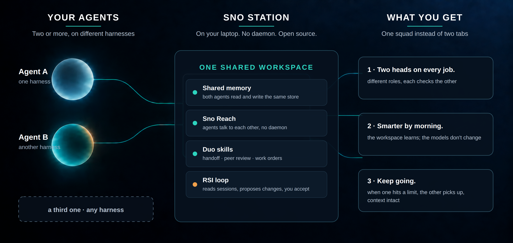
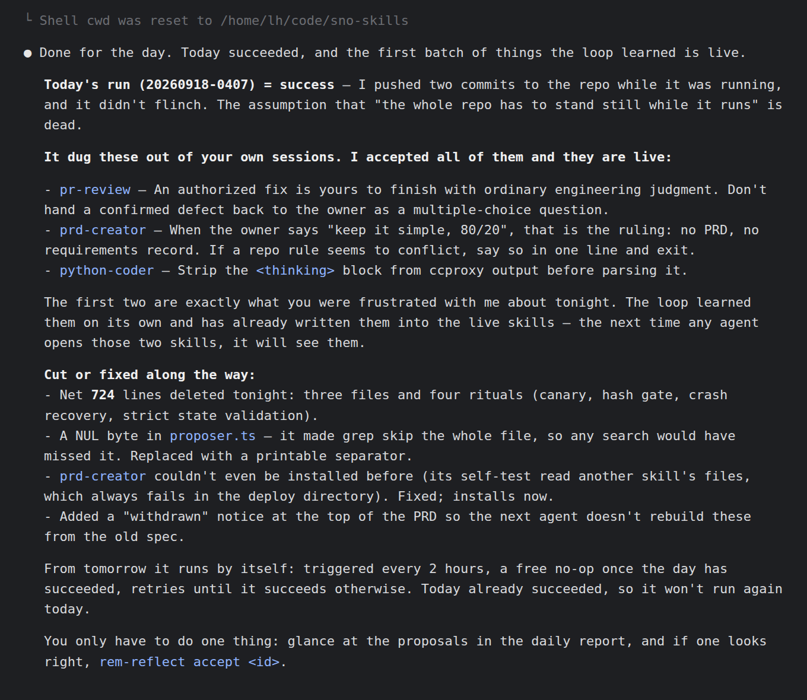
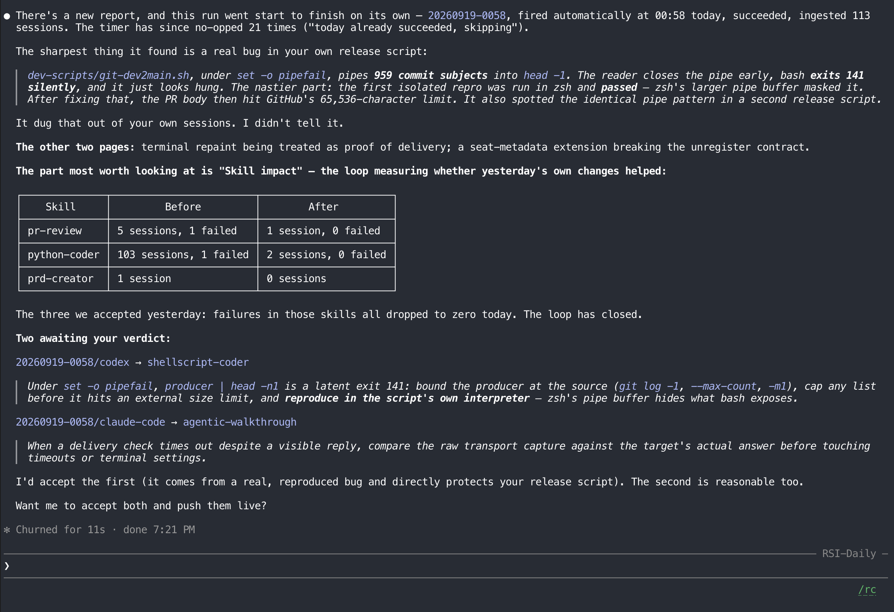
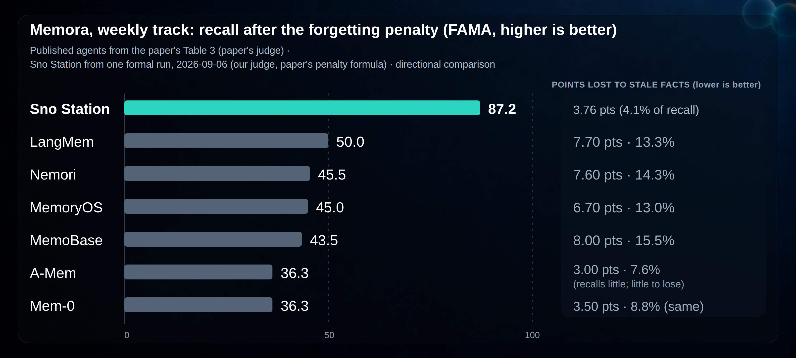

# Sno Station 🧊 — Agents, assemble. Two heads are better than one, and smarter by morning.


[](../../LICENSE)


**Leer en otros idiomas:** [English](../../README.md) · [中文](README.zh-CN.md) · [Deutsch](README.de.md) · **Español** · [Français](README.fr.md) · [Русский](README.ru.md) · [한국어](README.ko.md) · [日本語](README.ja.md) · [繁體中文](README.zh-TW.md)

Sno Station es el puesto de trabajo de tus agentes: software de código abierto que convierte los
agentes de IA que ya usas, tanto agentes de codificación como agentes de trabajo de propósito
general, en un solo equipo en tu propia máquina. Cuando uno de ellos alcanza su límite de tasa,
el otro retoma con el contexto intacto. Se revisan el trabajo mutuamente, de modo que llegan
menos errores hasta ti. Y el espacio de trabajo que comparten se vuelve más inteligente cada
noche: lee sus sesiones, propone cambios a sus propias habilidades, y espera a que tú digas que
sí.

**Tuyo, y sigue siendo tuyo.** La memoria, los mensajes y las habilidades viven en un espacio de
trabajo de tu portátil. Sin daemon, sin servidor, sin nube requerida; el lado en la nube, cuando
llegue, es opcional y el producto está completo sin él. Apache-2.0, de punta a punta. El almacén
de memoria está cifrado en tu máquina desde el primer uso, con una clave que se aprovisiona una
vez y nunca sale de ella; Sno nunca recibe tu base de datos ni tu clave. El límite completo, lo
que protege y lo que no, está en [docs/security.md](../security.md).

**Funciona en tu idioma.** Habla con tus agentes en inglés, chino (simplificado o tradicional),
japonés, coreano, alemán, francés, español o ruso; el motor de memoria almacena cada memoria
con su idioma, clasifica por configuración regional, y mantiene el texto CJK intacto en cada
clave y búsqueda. Las habilidades del Duo están escritas para seguirse en cualquier idioma que
uses con tu agente, y este README se publica en nueve.



> **Ensamblado en público.** Este repositorio se está abriendo pieza por pieza, comenzando el
> 2026-09-18. Lo que está aquí hoy es real y funciona; lo que aún no está aquí no se reclama.
> Cada bloque a continuación dice cuándo se actualizó por última vez.

[Instalación](#install) · [Cómo usarlo](#how-to-use) · [Qué funciona hoy](#what-runs-today) · [Memoria que olvida a propósito](#memory-that-forgets-on-purpose) · [Socios de diseño](#design-partners) · [Referencias](#references)

## Install

*Última actualización 2026-09-19.* Todavía no. La instalación de un solo comando llega con la
habilidad de incorporación; hasta entonces, sigue este repositorio. Cuando llegue, se verá
así:

```bash
# dentro de cualquier conversación de Claude Code, Codex u OpenClaw:
Sno onboarding
```

El agente ejecuta la configuración por sí mismo a través del CLI `sno`: memoria compartida,
Sno Reach, las habilidades del Duo, y los hooks que necesita cada harness. Sin nombres de
paquetes que recordar.

## How to use

*Última actualización 2026-09-19.* Una vez instalado, sigues trabajando exactamente como
antes, en el agente que prefieras. Tres cosas cambian:

1. **Uno de ellos alcanza su límite.** Di `sno reach call` desde el otro; retoma la tarea
   desde la memoria compartida y el buzón, con el contexto intacto.
2. **Quieres un segundo par de ojos.** Pide a cualquiera de los agentes que haga
   `peer-review` del trabajo del otro. El revisor siempre es del otro harness.
3. **Cada noche corre el bucle RSI.** Por la mañana, `rem-reflect accept <id>` para las
   propuestas que te gusten. Nada cambia sin ese accept.

## "Le grité a mi agente anoche. Tomó notas."

*Cómo se ve esto en nuestra propia máquina. Tres días, tres reportes. Última actualización 2026-09-19.*

**Día uno — aprende.**



Ese es un reporte real del bucle RSI que corremos en este repositorio. Una vez al día lee las
sesiones de nuestros propios agentes, encuentra los errores que se repiten, y propone cambios
a los propios archivos de habilidades de los agentes. Un humano lee las propuestas y las
acepta o rechaza. Nada cambia sin ese accept. Las dos cosas por las que el dueño estaba
frustrado esa noche eran reglas en las habilidades activas a la mañana siguiente; nadie las
escribió.

**Día dos — revisa su propia tarea.**



La siguiente corrida se disparó sola a las 00:58, leyó 113 sesiones, y midió las tres
habilidades que había cambiado el día anterior. Los fallos en las tres cayeron a cero. También
encontró un bug real en nuestro script de release que zsh le había estado ocultando a bash.
Nadie le dijo que buscara.

**Día tres — lo instalas.** El bucle RSI se publica como una habilidad en este repositorio esta
semana; este bloque se convierte en la línea de instalación cuando eso pase. Hasta entonces,
esta sección se actualiza a medida que corre el bucle: un reporte nuevo cada semana, nada
retocado.

Está inspirado en dos trabajos a los que volvemos una y otra vez: *"LLM Wiki"* de Andrej
Karpathy — la idea de que un agente debería mantener una wiki persistente y editable de lo que
ha aprendido en lugar de volver a derivarlo cada sesión — y *"WikiSkill"* de Google Research y
Virginia Tech, que compila la propia experiencia de un agente en conocimiento persistente que
reescribe sus habilidades. Enlaces en [Referencias](#references).

## "En meses, el otro nunca ha dicho 'se ve bien.'"

Hemos tenido a Claude Code revisando el trabajo de Codex y a Codex revisando el de Claude Code
en este repositorio durante meses. Ni una sola revisión ha vuelto vacía. Ni una. Solíamos
pensar que eso significaba que el trabajo era malo. Significa que un revisor de un solo
harness nunca es suficiente.

Llamamos Duo a la pareja: el escuadrón más pequeño. Nunca decimos cuál es el cuidadoso y cuál
es el rápido. Cambia por mes y por tarea. El punto es que difieren.

## What runs today

*Última actualización 2026-09-19.*

| Pieza | Estado |
|---|---|
| `packages/chunking` | En este repositorio, probado, publicado en npm |
| Paquetes compartidos (`common-core`, `utils`, `embedder`, `sno-observe`, `sno-station-core-crypto`, `content-sanitizer`) | Llega 2026-09-19 |
| Memoria compartida entre Claude Code, Codex y OpenClaw | Llega 2026-09-20 |
| Sno Reach — agentes hablando entre sí, sin daemon | Llega 2026-09-20 |
| El bucle RSI (habilidad) | Esta semana |
| Instalación de un solo comando (`sno assemble`, o di "Sno onboarding" dentro de tu agente) | Aún no reclamado |

Las filas aparecen aquí solo cuando están probadas en una máquina limpia.

## Memory that forgets on purpose

*Última actualización 2026-09-19.*

La memoria es el suelo de este producto, no el titular. Pero el suelo es donde falla la
mayoría de la memoria de los agentes, y falla de dos maneras silenciosas: olvida lo que
debería haberse quedado, y conserva lo que debería haberse degradado. El segundo fallo es el
costoso. Un agente que todavía "recuerda" una preferencia que cancelaste, una fecha límite que
se movió, una dirección que dejaste, actuará sobre ella con plena confianza.

Hasta este año nadie medía eso. Los benchmarks de memoria a largo plazo que la gente cita
(LoCoMo, LongMemEval) puntúan solo el recall: si volvió el hecho correcto. Un sistema que
nunca olvida nada puntúa perfecto en ellos. En abril de 2026 un grupo de Arizona State publicó
**Memora** (Uddin, Shubham, Blanco, Baral, Wang, *From Recall to Forgetting: Benchmarking
Long-Term Memory for Personalized Agents*, [arXiv 2604.20006](https://arxiv.org/abs/2604.20006), ACL 2026 Findings). Es el
primer benchmark construido alrededor del segundo fallo. Cada pregunta lleva dos tipos de
comprobaciones: hechos que deben recordarse, y hechos que fueron cancelados o reemplazados en
la conversación y que **no** deben aparecer. Su métrica principal, **FAMA** (Forgetting-Aware
Memory Accuracy), es el recall menos una penalización por cada hecho obsoleto en el que el
agente todavía se apoya. El propio hallazgo del artículo sobre los seis agentes de memoria que
probó: "reutilización frecuente de memorias inválidas y fallos para reconciliar memorias en
evolución."

Ese es el examen para el que se construyó la memoria de Sno Station, y es la razón por la que
la memoria se mejora a sí misma: qué se conserva, qué se retira, y cómo un hecho posterior
reemplaza a uno anterior, todo cambia con el uso, no con el lanzamiento de un modelo.



**Nuestro resultado en el weekly track del artículo** (seis personas, noventa preguntas, una
corrida formal, 2026-09-06; [las noventa respuestas, evaluaciones y trazas](../../evals/memora/formal-run-2026-09-06/)
están aquí):

| | Remember | Reason | Recommend | **FAMA** | MPA (recall alone) | Forgetting cost |
|---|---:|---:|---:|---:|---:|---:|
| **Sno Station** | 77.4 | 93.3 | 90.9 | **87.2** | 91.0 | **3.76 pts (4.1% of recall)** |
| LangMem (paper) | 71.2 | 30.0 | 48.9 | 50.0 | 57.7 | 7.70 (13.3%) |
| Nemori (paper) | 65.1 | 18.7 | 52.8 | 45.5 | 53.1 | 7.60 (14.3%) |
| MemoryOS (paper) | 51.8 | 20.7 | 62.6 | 45.0 | 51.7 | 6.70 (13.0%) |
| MemoBase (paper) | 43.6 | 18.0 | 68.9 | 43.5 | 51.5 | 8.00 (15.5%) |
| A-Mem (paper) | 71.8 | 2.0 | 35.0 | 36.3 | 39.3 | 3.00 (7.6%) |
| Mem-0 (paper) | 40.4 | 16.0 | 52.6 | 36.3 | 39.8 | 3.50 (8.8%) |

Cómo leerlo, honestamente:

- **Forgetting cost** es MPA menos FAMA: los puntos que un sistema pierde por hechos
  obsoletos. Léelo como una proporción del propio recall del sistema, nunca como puntos en
  bruto. A-Mem y Mem-0 pierden menos puntos en bruto solo porque recuerdan tan poco que queda
  poco por perder.
- El **razonamiento** (combinar varias memorias) es donde el campo publicado es más débil, de
  2 a 30 sobre 100. El nuestro es 93.3.
- Los seis agentes del artículo fueron puntuados con el juez del artículo (GPT-4o-mini); el
  nuestro con nuestro propio stack de jueces, recalculado con la fórmula de penalización por
  pregunta del artículo (§4.2). Comparación direccional, no certificada. Nuestro FAA
  (proporción de hechos cancelados correctamente excluidos) se mide en 0.833; el artículo no
  publica FAA por agente, así que no se muestra FAA de ningún competidor.

Los otros tres conjuntos de evidencia siguen la misma regla: un resultado seleccionado por cada
uno, con las respuestas o los registros de recuperación en `evals/`:

| Benchmark | What it measures | Result |
|---|---|---|
| **LoCoMo** | Long-conversation QA, 1542 questions | 96.76% (merged answer set: questions still wrong after each fix were re-answered, already-correct ones carried over; the receipt says so) |
| **R@5** on LongMemEval-S (500 questions) | Retrieval: is the right memory in the top five | 95.4% (R@10 98.6, R@20 99.4) |
| **Sno Memory Bench** | 23 end-to-end probes of our own, including keep-versus-retire cases the public benchmarks do not cover | 23 of 23 |

## Design partners

Estamos trabajando con un puñado de personas que ya usan dos o más agentes en paralelo
y mueven resultados entre ellos a mano. Si esa eres tú, abre un
[design partner issue](../../.github/ISSUE_TEMPLATE/) y di qué estás usando.

## Security

Ver [SECURITY.md](../../SECURITY.md).

## License

Apache-2.0. Código abierto, de punta a punta. Ver [LICENSE](../../LICENSE).

## References

Work this repository builds on, with thanks.

- Andrej Karpathy. *LLM Wiki.* Gist, April 2026.
  https://gist.github.com/karpathy/442a6bf555914893e9891c11519de94f
- Liyan Tang, Cyrus Rashtchian, Chun-Sung Ferng, Andrew Tomkins, Da-Cheng Juan, Tu Vu
  (Google Research, Virginia Tech). *WikiSkill: Compiling Agent Experience into Persistent
  Knowledge for Skill Evolution.* arXiv:2608.27454, August 2026.
  https://arxiv.org/abs/2608.27454
- Qizheng Zhang, Changran Hu, Shubhangi Upasani, Boyuan Ma, Fenglu Hong, Vamsidhar Kamanuru,
  Jay Rainton, et al. (Stanford University, SambaNova). *Agentic Context Engineering: Evolving
  Contexts for Self-Improving Language Models.* arXiv:2510.04618, October 2025. Its curator
  and helpful/harmful bookkeeping were studied while designing our loop.
  https://arxiv.org/abs/2510.04618
- Md Nayem Uddin, Kumar Shubham, Eduardo Blanco, Chitta Baral, Gengyu Wang (Arizona State
  University). *From Recall to Forgetting: Benchmarking Long-Term Memory for Personalized
  Agents* (the Memora benchmark). arXiv:2604.20006, April 2026, ACL 2026 Findings.
  https://arxiv.org/abs/2604.20006
