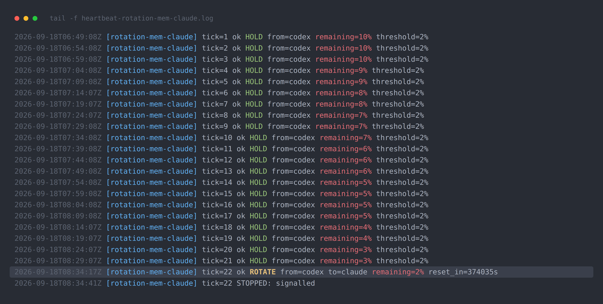

# Sno Station 🧊 — Agents, assemble. Two heads are better than one, and smarter by morning.


[](../../LICENSE)


**다른 언어로 읽기:** [English](../../README.md) · [中文](README.zh-CN.md) · [Deutsch](README.de.md) · [Español](README.es.md) · [Français](README.fr.md) · [Русский](README.ru.md) · **한국어** · [日本語](README.ja.md) · [繁體中文](README.zh-TW.md)

Sno Station은 여러분의 에이전트를 위한 워크스테이션입니다: 이미 실행하고 있는 AI 에이전트들 — 코딩 에이전트든 범용 작업 에이전트든 — 을 여러분의 컴퓨터에서 하나의 팀으로 만들어주는 오픈소스 소프트웨어입니다. 그중 하나가 사용량 제한에 도달하면, 다른 하나가 컨텍스트를 그대로 이어받아 작업을 계속합니다. 이들은 서로의 작업을 검토하므로, 여러분에게 도달하는 실수가 줄어듭니다. 그리고 이들이 공유하는 워크스페이스는 매일 밤 더 똑똑해집니다: 그들의 세션을 읽고, 자신의 스킬에 대한 변경을 제안하며, 여러분이 승인하기를 기다립니다.

**여러분의 것, 그리고 계속 여러분의 것으로 남습니다.** 메모리, 메시지, 스킬은 여러분의 노트북 안 하나의 워크스페이스에 있습니다. 데몬도, 서버도, 클라우드도 필요 없습니다. 클라우드 쪽 기능이 도입되더라도 그것은 선택 사항이며, 제품은 그것 없이도 완결됩니다. 처음부터 끝까지 Apache-2.0입니다. 메모리 저장소는 처음 사용할 때부터 여러분의 컴퓨터에서 암호화되며, 키는 한 번 프로비저닝된 후 절대 그 밖으로 나가지 않습니다. Sno는 여러분의 데이터베이스나 키를 결코 받지 않습니다. 이것이 무엇을 보호하고 무엇을 보호하지 않는지에 대한 전체 경계는 [docs/security.md](../security.md)에 있습니다.

**여러분의 언어로 작동합니다.** 영어, 중국어(간체 또는 번체), 일본어, 한국어, 독일어, 프랑스어, 스페인어, 러시아어 중 어떤 언어로든 에이전트와 대화하세요. 메모리 엔진은 각 메모리를 해당 언어와 함께 저장하고, 로케일별로 분류하며, 모든 키와 검색에서 한중일(CJK) 텍스트를 그대로 유지합니다. Duo 스킬은 여러분이 에이전트와 사용하는 언어가 무엇이든 그 언어로 따라할 수 있도록 작성되어 있으며, 이 README는 아홉 개 언어로 제공됩니다.


> **공개적으로 조립 중.** 이 저장소는 2026-09-18부터 한 조각씩 공개되고 있습니다. 오늘 여기 있는 것은 실제로 존재하고 작동하며, 아직 없는 것은 있다고 주장하지 않습니다. 아래의 각 블록은 마지막으로 업데이트된 시점을 표시합니다.

[설치](#install) · [사용 방법](#how-to-use) · [오늘 작동하는 것](#what-runs-today) · [일부러 잊어버리는 메모리](#memory-that-forgets-on-purpose) · [디자인 파트너](#design-partners) · [참고 자료](#references)

## 설치

*마지막 업데이트: 2026-09-19.* 아직입니다. 원커맨드 설치는 온보딩 스킬과 함께 제공될 예정입니다. 그때까지는 이 저장소를 지켜봐 주세요. 도입되면 다음과 같은 모습일 것입니다:

```bash
# inside any Claude Code, Codex or OpenClaw conversation:
Sno onboarding
```

에이전트는 `sno` CLI를 통해 직접 설정을 실행합니다: 공유 메모리, Sno Reach, Duo 스킬, 그리고 각 하네스에 필요한 훅까지. 기억해야 할 패키지 이름은 없습니다.

## 사용 방법

*마지막 업데이트: 2026-09-19.* 설치 후에도 여러분은 원하는 에이전트에서 이전과 똑같이 작업을 계속합니다. 달라지는 것은 세 가지입니다:

1. **그중 하나가 한도에 도달합니다.** 다른 에이전트에서 `sno reach call`이라고 말하세요. 공유 메모리와 메일박스에서 작업을 그대로 이어받습니다, 컨텍스트도 그대로요.
2. **다른 시각의 검토가 필요할 때.** 어느 쪽 에이전트에게든 상대방의 작업을 `peer-review`해 달라고 요청하세요. 검토자는 항상 다른 하네스 소속입니다.
3. **매일 밤 RSI 루프가 실행됩니다.** 아침에 마음에 드는 제안에 대해 `rem-reflect accept <id>`를 실행하세요. 승인 없이는 아무것도 바뀌지 않습니다.

## "어젯밤 나는 에이전트에게 화를 냈다. 에이전트는 그걸 메모해뒀다."

*우리 자신의 컴퓨터에서 실제로 이런 모습입니다. 사흘, 세 개의 보고서. 마지막 업데이트: 2026-09-19.*

**첫째 날 — 배운다.**


이것은 우리가 이 저장소에서 실행하는 RSI 루프에서 나온 실제 보고서입니다. 하루에 한 번 그것은 우리 자신의 에이전트 세션을 읽고, 반복되는 실수를 찾아내고, 에이전트 자신의 스킬 파일에 대한 변경을 제안합니다. 사람이 그 제안을 읽고 승인하거나 거부합니다. 그 승인 없이는 아무것도 바뀌지 않습니다. 그날 저녁 오너가 답답해했던 두 가지는 다음 날 아침이 되자 실제로 작동 중인 스킬의 규칙이 되어 있었습니다. 아무도 직접 입력하지 않았습니다.

**둘째 날 — 스스로 숙제를 확인한다.**


다음 실행은 새벽 00:58에 스스로 시작되어, 113개의 세션을 읽고 전날 바꾼 세 개의 스킬을 측정했습니다. 세 스킬 모두에서 실패율이 0으로 떨어졌습니다. 그것은 또한 zsh가 bash로부터 숨기고 있던 우리 릴리스 스크립트의 실제 버그도 찾아냈습니다. 아무도 찾아보라고 시키지 않았습니다.

**셋째 날 — 여러분이 설치한다.** RSI 루프는 이번 주 이 저장소에 스킬로 제공됩니다; 그렇게 되면 이 블록이 설치 명령어가 됩니다. 그때까지 이 섹션은 루프가 실행될 때마다 업데이트됩니다: 매주 새로운 보고서가 추가되며, 아무것도 손대지 않습니다.

이는 우리가 계속 돌아오게 되는 두 가지 작업에서 영감을 받았습니다: 세션마다 다시 도출하는 대신 에이전트가 배운 것을 지속적이고 편집 가능한 위키로 유지해야 한다는 아이디어를 담은 Andrej Karpathy의 *"LLM Wiki"*, 그리고 에이전트 자신의 경험을 지속적인 지식으로 컴파일하여 스킬을 다시 작성하는 Google Research와 Virginia Tech의 *"WikiSkill"*입니다. 링크는 [참고 자료](#references)에 있습니다.

## "몇 달 동안, 다른 쪽은 단 한 번도 '좋아 보이네요'라고 말한 적이 없다."

우리는 몇 달 동안 이 저장소에서 Claude Code가 Codex의 작업을 검토하고 Codex가 Claude Code의 작업을 검토하게 해왔습니다. 빈손으로 돌아온 리뷰는 단 하나도 없었습니다. 단 하나도요. 우리는 예전에 그것이 작업이 나쁘다는 뜻이라고 생각했습니다. 사실은 한 하네스의 리뷰어 하나만으로는 결코 충분하지 않다는 뜻입니다.

우리는 이 둘을 Duo라고 부릅니다: 가장 작은 팀입니다. 우리는 어느 쪽이 신중한 쪽이고 어느 쪽이 빠른 쪽인지 절대 말하지 않습니다. 그것은 달마다, 작업마다 뒤바뀝니다. 핵심은 그 둘이 서로 다르다는 것입니다.

## "나는 잠자리에 들었다. 에이전트는 교대를 했다."

*우리 자신의 컴퓨터에서 실제로 이런 모습입니다, 2026-09-18.*



우리 에이전트 중 하나가 27개 작업으로 이루어진 빌드에서 21개째 작업을 진행하던 중 주간 사용량이 2%에
도달했습니다. 에이전트는 거기서 멈춰 서서 죽기를 기다리지 않았습니다. 인수인계 브리프를 작성했습니다:
무엇이 끝났는지, 무엇이 절반만 끝났는지, 이어서 작업할 정확한 커밋이 무엇인지. 그런 다음 다른 하네스의
에이전트를 깨웠고, 그 에이전트가 브리프의 크기와 체크섬을 측정하고 그렇게 했다고 말하기 전까지는
아무것도 건드리지 못하게 했습니다.

한 가지가 잘못되었는데, 그것이 바로 읽어볼 가치가 있는 부분입니다. 인수자가 인계 승인을 확인하기도
전에 편집을 시작했습니다. 인계자가 그것을 잡아내어 멈추게 하고, 브리프를 다시 쓰고, 제대로 다시
인계했습니다. 인수인계가 시작된 지 14분 41초 후, 두 번째 에이전트는 작업 중이었고 첫 번째 에이전트는
1%를 남긴 채 물러났습니다. 인수인계 이전의 모든 커밋은 온전히 남아 있습니다; 두 번째 에이전트는
처음부터가 아니라 첫 번째 미완료 작업부터 이어갔습니다. 그동안 나는 내내 자고 있었습니다.

그날 밤 전체는 [docs/evidence/rotation-2026-09-18/](../evidence/rotation-2026-09-18/)에 있습니다:
5분 간격의 모든 사용량 기록, 브리프의 두 버전, 준비 완료와 인계 영수증, 그리고 커밋 요약까지.
호스트 이름, 주소, 세션 ID는 가려져 있으며, 그 밖에는 아무것도 손대지 않았습니다.

## 오늘 작동하는 것

*마지막 업데이트: 2026-09-20.*

| 구성 요소 | 상태 |
|---|---|
| `packages/chunking` | 이 저장소에 있으며, 테스트를 거쳤고, npm에 게시됨 |
| 공유 패키지 (`common-core`, `utils`, `embedder`, `sno-observe`, `sno-station-core-crypto`, `content-sanitizer`) | 이 저장소에 있음 |
| Claude Code, Codex, OpenClaw 간 공유 메모리 | 엔진과 세 가지 스킨 모두 이 저장소에 있음; 클린 머신 검증 대기 중 |
| Sno Reach — 데몬 없이 에이전트끼리 대화하기 | 소스는 이 저장소에 있음; 릴리스 아카이브 대기 중 |
| RSI 루프 (스킬) | 이번 주 |
| 원커맨드 설치 (`sno assemble`, 또는 에이전트 안에서 "Sno onboarding"이라고 말하기) | 아직 공개되지 않음 |

행은 깨끗한 컴퓨터에서 실행된 경우에만 "검증됨"이라고 표시됩니다; 그때까지는 지금 무엇이 있는지를 말합니다.

## 일부러 잊어버리는 메모리

*마지막 업데이트: 2026-09-19.*

메모리는 이 제품의 헤드라인이 아니라 바닥입니다. 하지만 대부분의 에이전트 메모리가 실패하는 곳이 바로 그 바닥이며, 실패는 두 가지 조용한 방식으로 일어납니다: 남아 있어야 할 것을 잊어버리거나, 사라졌어야 할 것을 계속 간직하는 것입니다. 두 번째 실패가 더 값비쌉니다. 여러분이 취소한 선호, 바뀐 마감일, 떠난 주소를 여전히 "기억하는" 에이전트는 그것을 완전한 확신을 가지고 실행에 옮길 것입니다.

올해 전까지는 아무도 그것을 측정하지 않았습니다. 사람들이 자주 인용하는 장기 메모리 벤치마크(LoCoMo, LongMemEval)는 회상만을 점수화합니다: 올바른 사실이 돌아왔는가. 아무것도 잊지 않는 시스템은 이 벤치마크에서 만점을 받습니다. 2026년 4월 애리조나 주립대학의 한 연구팀이 **Memora**를 발표했습니다(Uddin, Shubham, Blanco, Baral, Wang, *From Recall to Forgetting: Benchmarking Long-Term Memory for Personalized Agents*, [arXiv 2604.20006](https://arxiv.org/abs/2604.20006), ACL 2026 Findings). 이는 두 번째 실패를 중심으로 설계된 최초의 벤치마크입니다. 각 질문은 두 종류의 검사를 포함합니다: 반드시 회상되어야 하는 사실, 그리고 대화 중에 취소되거나 대체되어 절대 다시 나타나서는 **안 되는** 사실입니다. 이 벤치마크의 대표 지표인 **FAMA**(Forgetting-Aware Memory Accuracy)는 회상 점수에서 에이전트가 여전히 의존하는 오래된 사실 하나하나에 대한 패널티를 뺀 값입니다. 테스트된 여섯 개 메모리 에이전트에 대한 논문 자체의 결론은 다음과 같습니다: "무효한 메모리를 자주 재사용하고, 진화하는 메모리를 조정하는 데 실패한다."

그것이 바로 Sno Station의 메모리가 통과하도록 설계된 시험이며, 메모리가 스스로 개선되는 이유이기도 합니다: 무엇을 남기고, 무엇을 퇴출시키고, 나중 사실이 이전 사실을 어떻게 대체하는지가 모두 모델 출시가 아니라 사용에 따라 바뀝니다.


**논문의 주간 트랙에 대한 우리의 결과** (여섯 개 페르소나, 90개 질문, 1회 공식 실행, 2026-09-06; [90개 질문의 답변, 판정, 트레이스](../../evals/memora/formal-run-2026-09-06/)가 모두 여기에 있습니다):

| | 기억 | 추론 | 추천 | **FAMA** | MPA (회상만) | 망각 비용 |
|---|---:|---:|---:|---:|---:|---:|
| **Sno Station** | 77.4 | 93.3 | 90.9 | **87.2** | 91.0 | **3.76점 (회상의 4.1%)** |
| LangMem (논문) | 71.2 | 30.0 | 48.9 | 50.0 | 57.7 | 7.70 (13.3%) |
| Nemori (논문) | 65.1 | 18.7 | 52.8 | 45.5 | 53.1 | 7.60 (14.3%) |
| MemoryOS (논문) | 51.8 | 20.7 | 62.6 | 45.0 | 51.7 | 6.70 (13.0%) |
| MemoBase (논문) | 43.6 | 18.0 | 68.9 | 43.5 | 51.5 | 8.00 (15.5%) |
| A-Mem (논문) | 71.8 | 2.0 | 35.0 | 36.3 | 39.3 | 3.00 (7.6%) |
| Mem-0 (논문) | 40.4 | 16.0 | 52.6 | 36.3 | 39.8 | 3.50 (8.8%) |

정직하게 읽는 방법:

- **망각 비용**은 MPA에서 FAMA를 뺀 값으로, 시스템이 오래된 사실 때문에 잃는 점수입니다. 이를 원점수가 아니라 그 시스템 자신의 회상 대비 비율로 읽으세요. A-Mem과 Mem-0의 원점수 손실이 적은 것은 단지 회상하는 양 자체가 적어서 잃을 것이 별로 없기 때문입니다.
- **추론**(여러 메모리를 결합하는 것)은 공개된 분야에서 가장 약한 부분으로, 100점 만점에 2~30점 수준입니다. 우리는 93.3점입니다.
- 논문의 여섯 에이전트는 논문의 심사자(GPT-4o-mini)로 채점되었고, 우리 쪽은 우리 자신의 심사 스택으로 채점한 뒤 논문의 질문별 패널티 공식(§4.2)으로 재계산했습니다. 이는 방향성 있는 비교이지 공인된 비교가 아닙니다. 우리의 FAA(취소된 사실 중 올바르게 제외된 비율)는 0.833으로 측정되었습니다. 논문은 에이전트별 FAA를 공개하지 않으므로 경쟁 제품의 FAA는 표시하지 않았습니다.

나머지 세 증거 세트도 같은 규칙을 따릅니다. 각각 하나의 공식 결과를 선택하고, 그 답변이나
검색 기록을 `evals/`에 담았습니다:

| 벤치마크 | 측정 대상 | 결과 |
|---|---|---|
| **LoCoMo** | 장문 대화 QA, 1542개 질문 | 96.76% (병합 답변 세트: 각 수정 후에도 여전히 틀린 질문은 다시 답변했고, 이미 맞은 질문은 그대로 이어받았습니다; 영수증에 그렇게 명시되어 있습니다) |
| LongMemEval-S(500개 질문)의 **R@5** | 검색: 올바른 메모리가 상위 5개 안에 있는가 | 95.4% (R@10 98.6, R@20 99.4) |
| **Sno Memory Bench** | 공개 벤치마크가 다루지 않는 유지-대-퇴출 사례를 포함한, 우리 자체의 23개 엔드투엔드 검증 | 23개 중 23개 |

## 디자인 파트너

우리는 이미 두 개 이상의 에이전트를 나란히 실행하면서 그 사이에서 결과를 수동으로 옮기고 있는 소수의 사람들과 함께 작업하고 있습니다. 여러분이 그런 경우라면, [디자인 파트너 이슈](https://github.com/sno-ai/sno-station/issues/new?template=design-partner.yml)를 열어 무엇을 실행하고 있는지 알려주세요.

## 보안

[SECURITY.md](../../SECURITY.md)를 참고하세요.

## 라이선스

Apache-2.0. 처음부터 끝까지 오픈소스입니다. [LICENSE](../../LICENSE)를 참고하세요.

## References

Work this repository builds on, with thanks.

- Andrej Karpathy. *LLM Wiki.* Gist, April 2026.
  https://gist.github.com/karpathy/442a6bf555914893e9891c11519de94f
- Liyan Tang, Cyrus Rashtchian, Chun-Sung Ferng, Andrew Tomkins, Da-Cheng Juan, Tu Vu
  (Google Research, Virginia Tech). *WikiSkill: Compiling Agent Experience into Persistent
  Knowledge for Skill Evolution.* arXiv:2608.27454, August 2026.
  https://arxiv.org/abs/2608.27454
- Qizheng Zhang, Changran Hu, Shubhangi Upasani, Boyuan Ma, Fenglu Hong, Vamsidhar Kamanuru,
  Jay Rainton, et al. (Stanford University, SambaNova). *Agentic Context Engineering: Evolving
  Contexts for Self-Improving Language Models.* arXiv:2510.04618, October 2025. Its curator
  and helpful/harmful bookkeeping were studied while designing our loop.
  https://arxiv.org/abs/2510.04618
- Md Nayem Uddin, Kumar Shubham, Eduardo Blanco, Chitta Baral, Gengyu Wang (Arizona State
  University). *From Recall to Forgetting: Benchmarking Long-Term Memory for Personalized
  Agents* (the Memora benchmark). arXiv:2604.20006, April 2026, ACL 2026 Findings.
  https://arxiv.org/abs/2604.20006
